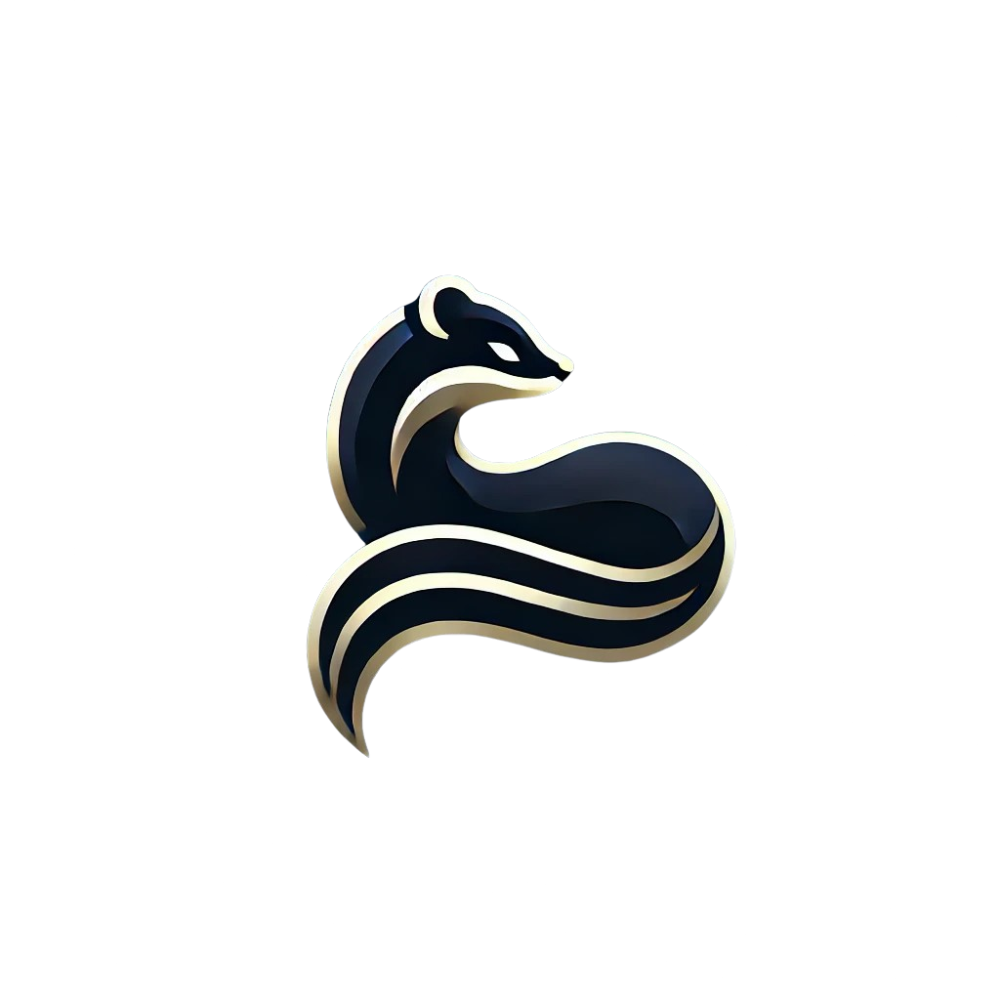
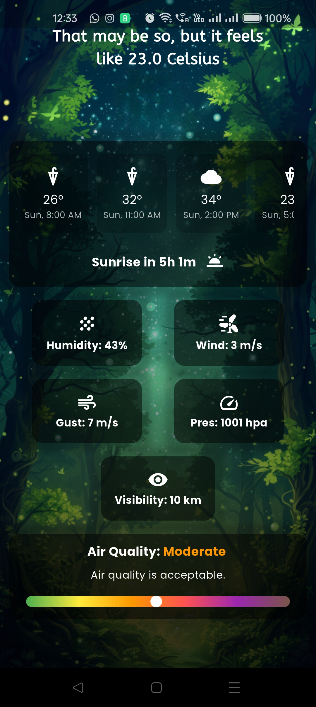
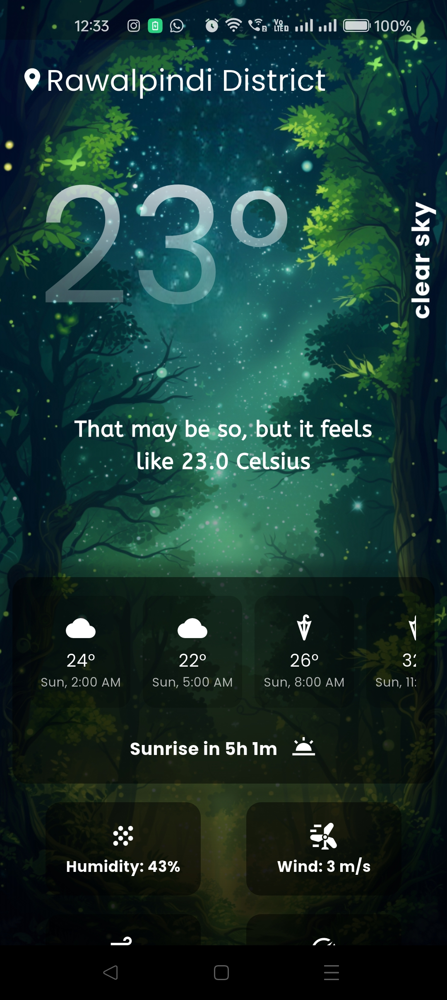
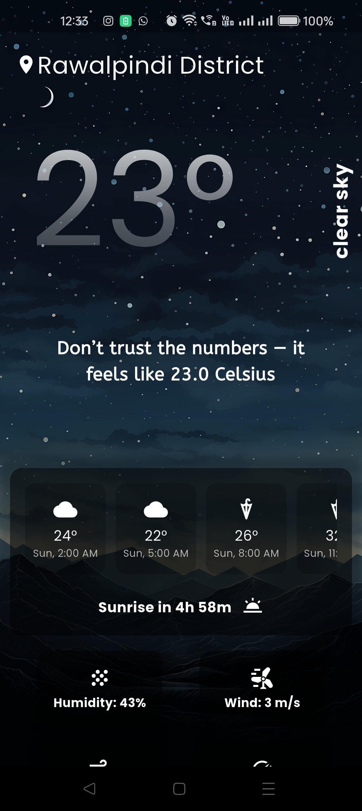
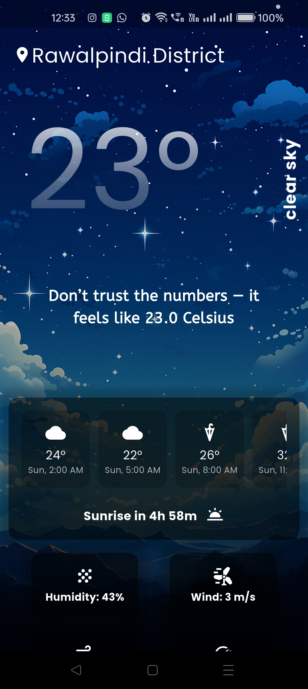

<p align="center">
  
</p>


# SableSky
*A weather mobile application I created as part of my Flutter learning journey.*


## 🎥 SableSky in action
[Watch the video here](https://www.youtube.com/shorts/t-s9l7EBMwY)
[And here!](https://www.youtube.com/shorts/P8F4mD-KU3I)


## 📸 Screenshots
<p align="center" style="margin-bottom: 30px;">
  
  
</p>
<p align="center">
  
  
</p>


## 📋 Features
- Weather Forecast
- Changing Wallpapers according to the weather


## 🛠️ Tech Stack
**Frontend:** Flutter  


## 🗒️ Important Info
- The wallpapers are not mine. They are from a mobile app named [backdrops](https://www.backdrops.io). 


## 🧠 Lessons Learned
Coming to Flutter from React Native was definitely a unique experience. React and React Native are so similar in terms of syntax, but when you start with Flutter, it is completely different, yet exciting. It took me a while to get an understanding of it, but eventually, I did.


## 🔥 How to Run Locally
```bash
git clone https://github.com/TayyabNaveed16/SableSky.git
cd your-repo
flutter pub get
dart run flutter_launcher_icons
dart run flutter_native_splash:create --path=native_splash.yaml


